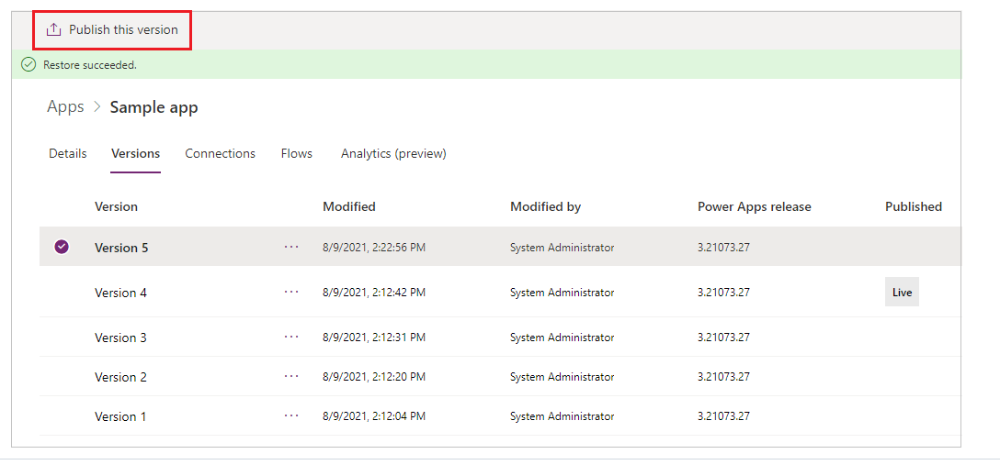

# Restore a canvas app to a previous version

[This article is prerelease documentation and is subject to change.]

This article shows you how to restore a canvas app to a previous version that was saved to the cloud from your Power Apps account.

## Restore an app from your account

1. Sign in to [Power Apps](https://make.powerapps.com).

1. On the left navigation pane, select **Apps**. 

    

1. Select your app and then select **Details** on the command bar.

    > [!NOTE]
    > If the app that you want to restore doesn't appear, make sure that you're in the right environment.

1. Select **Versions** and then select the app version that you want to restore.

    

1. Select **Restore** and confirm your changes by selecting **Restore** again.

    > [!NOTE]
    > - Only the app owner can restore a version of an app. To set a user as the owner of an app, use the [Power Apps cmdlets for administrators](/power-platform/admin/powerapps-powershell).
    > - For apps older than 6 months, this action will repackage the app with the oldest version available. Functionality may have changed from the original packaging of the app

    New version is created.

1. (Optional) If you want to publish the restored version, select **Publish this version**, and then select **Publish this version** when prompted to confirm.

    

    Notice the published restore version that shows up as **Live**.
    
    

    > [!NOTE]
    > **Publish this version** option only appears for the latest unpublished version of an app.

## More resources
[Share an app](share-app.md)  
[Change app name and tile](set-name-tile.md)  
[Delete an app](delete-app.md)

[!INCLUDE[footer-include](../../includes/footer-banner.md)]
